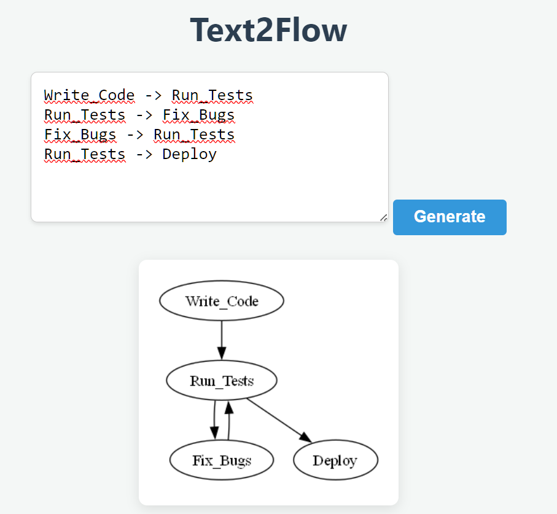
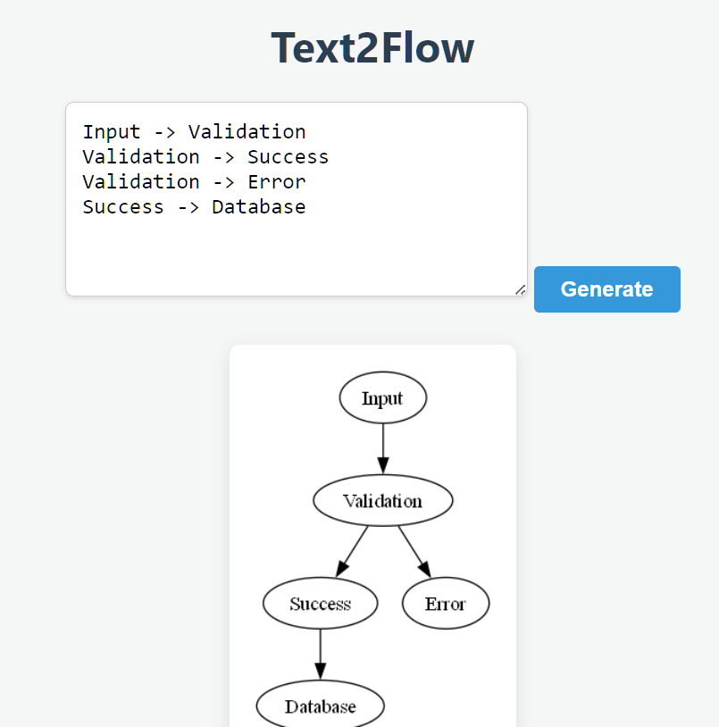
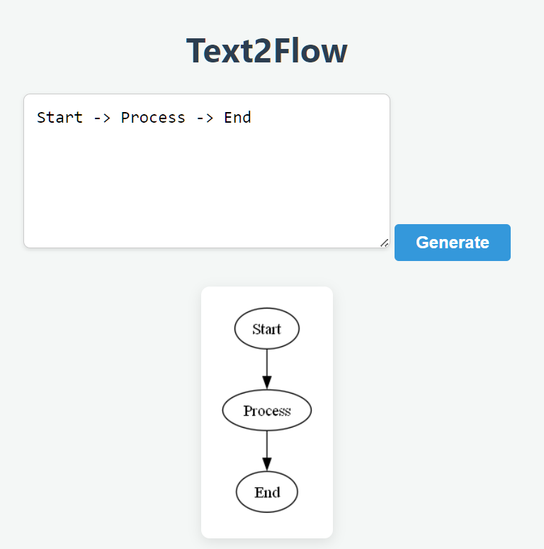

# 📊 Text2Flow


A lightweight, high-performance web application that converts simple text syntax into professional SVG/PNG flowcharts. Built with FastAPI and powered by the Graphviz visualization engine.

---

# ✨ Features

- Instant Rendering: Convert text to diagrams in real-time.

- Simple Syntax: No complex drag-and-drop; just type A -> B.

- Clean API: Decoupled backend for programmatic diagram generation.

- Responsive UI: Minimalist editor with live preview.

---

<details>
  <summary>📸Screenshots</summary>
  
  <br>

  <table>
    <tr>
      <td align="center"><b>View 3</b></td>
      <td align="center"><b>View 2</b></td>
      <td align="center"><b>View 1</b></td>
    </tr>
    <tr>
      <td></td>
      <td></td>
      <td></td>
    </tr>
  </table>

</details>

---

# 🚀 Getting Started

Prerequisites
- Python 3.8+

- Graphviz Software: This app requires the Graphviz binaries to be installed on your system.

- Windows: Download here. Ensure you check "Add Graphviz to system PATH" during installation.

- macOS: brew install graphviz

- Linux: sudo apt install graphviz

---

# ⚙️ Installation
Clone the repository:

```Bash
git clone https://github.com/yourusername/text2flow.git
cd text2flow
```
## Create and activate a virtual environment:

```Bash
python -m venv venv
# Windows
.\venv\Scripts\activate
# macOS/Linux
source venv/bin/activate
```
## Install dependencies:

```Bash
pip install fastapi uvicorn graphviz jinja2 python-multipart pyragify
```
## Run the server:

```Bash
uvicorn app.main:app --reload
```
Open your browser to http://127.0.0.1:8000.

---

<details>
  <summary>📝 How to Use</summary>

The editor uses a simple arrow-based syntax (->) to define relationships between nodes.

```
Basic Flow
Plaintext
Start -> Process -> End
Branching & Decisions
You can create multiple paths by starting a new line with the same node name.
```

```
Input -> Validation
Validation -> Success
Validation -> Error
Success -> Database
Feedback Loops
Graphviz automatically handles the layout for circular logic.
```

```
Write_Code -> Run_Tests
Run_Tests -> Fix_Bugs
Fix_Bugs -> Run_Tests
Run_Tests -> Deploy
```

</details>

---

# 🛠️ Project Structure

```
text2flow/
├── app/
│   ├── main.py
│   ├── routers/
│   │   └── api.py          
│   ├── services/
│   │   ├── parser.py
│   │   ├── renderer.py
│   │   └── logger.py       
│   ├── static/
│   │   ├── css/style.css
│   │   └── js/app.js
│   └── templates/
│       └── editor.html
├── .gitignore                      
├── LICENSE                
├── README.md               
└── requirements.txt        
```

---

# 🧪 Tech Stack

* **Backend: FastAPI (Python)**

* **Rendering: Graphviz**

* **Frontend: Vanilla JS, CSS3, HTML5**

* **Server: Uvicorn**

---

# 💻 Analysis
This repository includes a config.yaml for use with **pyragify**. To generate a single-file codebase for analysis in LLMs like NotebookLM, run:
- python -m pyragify --config-file config.yaml

---

<details>
  <summary>🛣️ Roadmap Features</summary>

- [ ] SVG Support: Add an option to render as SVG for infinite scaling without pixelation.

- [ ] Persistence: Use a database (SQLite) to allow users to save their diagrams and get a unique URL to share them.

- [ ] Dockerization: Containerize the app so that Graphviz dependencies are handled automatically regardless of the OS.

- [ ] Export to PDF: Generate print-ready documents of the flowcharts.

</details>

---

<details>
  <summary>🤝 Contributions</summary>

- Reporting Bugs: Open an issue with a clear description and steps to reproduce the error.

- Suggesting Enhancements: Have an idea for a new shape or color syntax? Open an issue to discuss it!

- Pull Requests: * Fork the repo.

- Create your feature branch (git checkout -b feature/AmazingFeature).

- Commit your changes (git commit -m 'Add some AmazingFeature').

- Push to the branch (git push origin feature/AmazingFeature).

- Open a Pull Request.

</details>

---

* **Built by Roy Peters**
[](https://www.linkedin.com/in/roy-p-74980b382/)


